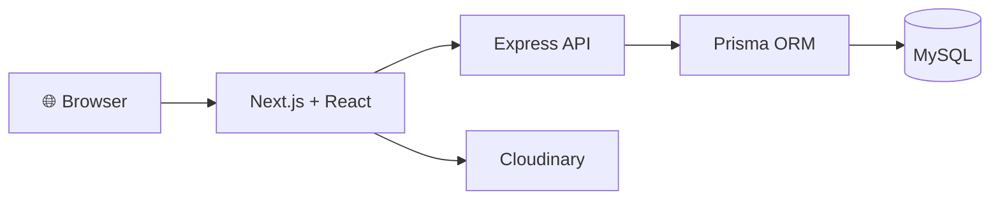

# 🛍️ UniBazaar

<p align="center">
  <strong>A university community marketplace for buying, selling, and discovering things within campus.</strong>
</p>

<p align="center">
  <a href="#-product-vision">Vision</a> •
  <a href="#-how-it-works">How It Works</a> •
  <a href="#-mvp-scope">MVP</a> •
  <a href="#-tech-stack">Tech Stack</a> •
  <a href="#-getting-started">Getting Started</a> •
  <a href="#-project-documentation">Documentation</a>
</p>

<p align="center">
  
  
  
  
  
  
</p>

---

## 🌱 What is UniBazaar?

**UniBazaar** is a university-focused marketplace designed to make buying and selling within a university community simple, organized, and trustworthy.

Students can use UniBazaar to:

* 🛒 discover things other students are selling
* 📦 create listings for items they want to sell
* 🔎 search and filter marketplace listings
* 📸 add product images and useful details
* 🤝 contact sellers directly
* ✅ mark items as sold when a deal is completed

The core idea is simple:

> **UniBazaar helps students discover sellers and connect with them. The actual conversation and deal can happen outside UniBazaar.**

UniBazaar is **not intended to become an e-commerce payment or chat platform in the MVP**.

---

## 🎯 Product Vision

University students frequently buy and sell things through scattered Facebook posts, Messenger groups, and personal contacts.

This creates several problems:

* Posts disappear quickly in busy groups.
* Searching for a specific item is difficult.
* Listings are mixed with unrelated content.
* Buyers do not have a dedicated campus marketplace.
* Sellers have no clean way to manage their listings.
* Old or forgotten posts remain visible long after an item is unavailable.

UniBazaar aims to provide a **focused marketplace for the university community**.

### The long-term vision

```text
                         🛍️ UNIBAZAAR
                              │
               ┌──────────────┴──────────────┐
               │                             │
        🛒 Marketplace                 🏪 Campus Stores
               │                             │
      Student-to-student             Student-run businesses
               │                             │
      Used / individual items        Multiple products
               │                             │
      Books • Bikes • Phones         Jewelry • Fruits
      Calculators • Furniture        Sarees • Umbrellas
```

---

# 🛒 Marketplace

The **Marketplace** is the first and most important part of UniBazaar.

It focuses on ordinary student-to-student selling.

### Typical examples

* 📚 Used textbooks
* 🧮 Calculators
* 🚲 Bicycles
* 🪑 Tables and chairs
* 🎧 Headphones
* 💻 Electronics
* 👕 Clothes
* 🏠 Hall / room items
* 📦 Moving-out sales

---

## 👤 Two Simple User Roles

UniBazaar keeps the MVP intentionally simple.

### Seller

A seller can:

```text
Create Listing
      ↓
Publish Listing
      ↓
Receive Buyer Contact
      ↓
Discuss Outside UniBazaar
      ↓
Make Deal
      ↓
Mark Item as Sold
```

### Buyer

A buyer can:

```text
Browse
   ↓
Search / Filter
   ↓
Open Listing
   ↓
View Details
   ↓
Contact Seller
   ↓
Discuss & Deal
```

A user does not need to become a separate "buyer account" or "seller account".

A normal university user can do both.

---

# 📦 Listing Types

UniBazaar is designed to support two common ways students sell things.

## 1. Single-item listing

Example:

```text
Casio Calculator
৳800

Used • Good condition
📍 Hall 3

[ Contact Seller ]
```

This is the normal listing type.

---

## 2. Multiple-item / Bundle listing

Sometimes a student needs to sell many things at once.

For example:

> **Moving Out Sale**

```text
Study Chair       ৳800
Fan               ৳1,200
Mattress          ৳1,500
Books             ৳500
Rice Cooker       ৳900
```

Instead of creating five separate posts, a seller should eventually be able to create **one bundle listing containing multiple items**.

Each item should remain individually identifiable so that:

* buyers can find specific items
* one item can become sold while others remain available
* the seller does not need to publish many separate posts

This feature is part of the product direction and may be implemented after the core single-item marketplace is stable.

---

# 🔎 Search & Discovery

UniBazaar should make finding a product easier than searching through social media posts.

The marketplace should support:

* 🔍 keyword search
* 🗂️ category filtering
* 🆕 newest listings
* 📍 useful listing details such as location
* 🔴 sold / unavailable status
* 🖼️ product images

The goal is simple:

> **A buyer should be able to find a useful campus item in seconds instead of scrolling through hundreds of posts.**

---

# 🤝 Buyer ↔ Seller Communication

UniBazaar does **not** need its own chat system for the MVP.

Instead, UniBazaar acts as a **discovery and connection layer**.

### Example flow

```text
Buyer finds product
       ↓
[ Contact Seller ]
       ↓
WhatsApp / Messenger
       ↓
Buyer ↔ Seller
       ↓
Deal
```

Possible communication channels may include:

* 🟢 WhatsApp
* 🔵 Messenger
* ✉️ Email

The seller controls which contact methods are exposed.

### Why no built-in chat?

Because building chat would introduce unnecessary complexity:

* WebSockets / Socket.IO
* message storage
* unread state
* notifications
* moderation
* conversation management
* real-time infrastructure

Those are not necessary for the core UniBazaar problem.

---

# ✅ Listing Lifecycle

A listing should represent its real-world state.

Conceptually:

```text
ACTIVE
  │
  ├───────────────→ SOLD
  │
  └───────────────→ EXPIRED
```

### 🟢 ACTIVE

The item is currently being offered.

### 🔴 SOLD

The seller has confirmed that the item was sold.

### 🟡 EXPIRED

The listing became stale and the seller did not confirm availability.

> **Expired does not mean sold.**

This distinction matters because UniBazaar cannot see what happened inside an external WhatsApp or Messenger conversation.

The seller remains the source of truth.

Future versions may remind sellers:

> **"Is this item still available?"**

---

# 🏪 Campus Stores — Future Direction

UniBazaar is intended to grow beyond one-off marketplace listings.

Some students operate small ongoing businesses on campus, such as:

* 🍉 seasonal fruit sellers
* 💍 jewelry sellers
* 👗 saree / clothing sellers
* ☔ umbrella sellers
* 🍔 food sellers
* 🎁 gift / accessory sellers

These sellers have a different need.

### Marketplace

> "I am selling this item."

### Campus Store

> "I run this small business."

The long-term vision is therefore:

```text
UniBazaar
│
├── 🛒 Marketplace
│     └── Student-to-student listings
│
└── 🏪 Campus Stores
      └── Student-run businesses
```

Campus Stores are **not the first MVP priority**.

The architecture should remain flexible enough to support them later without forcing unnecessary complexity into the MVP.

---

# 🚧 MVP Scope

The first usable version of UniBazaar should focus on the following:

### ✅ Core MVP

* [x] Student authentication
* [x] University email restriction
* [x] JWT authentication
* [x] Create product listing
* [x] Browse listings
* [x] Category filtering
* [x] Product details
* [x] Seller-owned listing management
* [x] Mark listing as sold
* [x] Delete listing
* [x] External seller contact
* [ ] Search improvements
* [ ] Listing expiration
* [ ] Listing renewal
* [ ] Robust multi-image / bundle listing support
* [ ] Production deployment and end-to-end testing

### 🚫 Explicitly Not MVP

The following are intentionally postponed:

* ❌ Shopping cart
* ❌ Checkout
* ❌ Online payment
* ❌ In-app chat
* ❌ Socket.IO / WebSocket chat infrastructure
* ❌ Complex order management
* ❌ Reviews and ratings
* ❌ Seller analytics
* ❌ AI recommendations
* ❌ Microservices
* ❌ Redis / Kafka / Kubernetes
* ❌ Other infrastructure that does not solve an immediate product problem

These may become future features only when there is a clear reason to add them.

---

# 🧠 Development Philosophy

UniBazaar is also a **learning project**.

The project is being developed while learning modern web development.

Therefore, the project follows a few principles:

### 1. Build for today, design for tomorrow

The code should be simple enough to understand now while keeping clean boundaries so the architecture can evolve later.

### 2. Avoid premature complexity

Do not introduce advanced infrastructure simply because large applications use it.

### 3. Understand before changing

Before modifying an existing feature:

1. inspect the current implementation
2. understand what already works
3. identify the smallest required change
4. implement it
5. test it
6. document important decisions

### 4. AI is an accelerator, not the product architect

AI tools are used heavily to accelerate implementation, debugging, and exploration.

However, product decisions and architectural decisions should remain intentional and documented.

---

# 🏗️ Current Architecture

UniBazaar currently uses a decoupled frontend/backend architecture.



### Frontend

* Next.js
* React
* TypeScript

### Backend

* Node.js
* Express
* TypeScript

### Database

* MySQL

### ORM

* Prisma

### Image Hosting

* Cloudinary

### Authentication

* bcrypt
* JWT

---

# 📁 Repository Structure

```text
uniBazaar/
│
├── backend/
│   ├── prisma/
│   └── src/
│
├── frontend/
│   ├── app/
│   ├── components/
│   ├── context/
│   └── lib/
│
├── docs/
│   ├── PRODUCT_SPEC.md
│   └── ARCHITECTURE.md
│
├── .github/
│   └── pull_request_template.md
│
├── GEMINI.md
├── README.md
└── .gitignore
```

The project structure may evolve as the application grows.

---

# 🧰 Tech Stack

| Layer            | Technology                |
| ---------------- | ------------------------- |
| Frontend         | Next.js                   |
| UI               | React                     |
| Language         | TypeScript                |
| Backend          | Node.js + Express         |
| ORM              | Prisma                    |
| Database         | MySQL                     |
| Authentication   | JWT + bcrypt              |
| Image Hosting    | Cloudinary                |
| Frontend Hosting | Vercel                    |
| Backend Hosting  | TBD / production platform |
| Database Hosting | Aiven MySQL               |

---

# 🚀 Getting Started

## Prerequisites

You should have:

* Node.js 18+
* npm
* MySQL database access
* Git

---

## 1. Clone the repository

```bash
git clone https://github.com/sagorroy2003/uniBazaar.git
cd uniBazaar
```

---

## 2. Start the backend

```bash
cd backend
npm install
```

Create a `.env` file from `.env.example`.

At minimum, configure the database and JWT secret.

Then:

```bash
npm run prisma:generate
npm run prisma:migrate
npm run prisma:seed
npm run dev
```

The backend runs on:

```text
http://localhost:4000
```

---

## 3. Start the frontend

Open another terminal:

```bash
cd frontend
npm install
```

Create `.env.local` from `.env.example`.

Set:

```env
NEXT_PUBLIC_API_BASE_URL="http://localhost:4000"
```

Then:

```bash
npm run dev
```

Open:

```text
http://localhost:3000
```

---

# 🧪 Basic Smoke Test

After both servers are running:

1. Open the homepage.
2. Create a university account.
3. Log in.
4. Create a product listing.
5. Confirm the listing appears.
6. Open the product details.
7. Test the seller contact options.
8. Mark the listing as sold.
9. Verify the sold state.
10. Test seller-owned actions such as editing or deleting the listing.

---

# 📚 Project Documentation

The repository keeps important project decisions close to the codebase.

### 📌 Product Specification

**[`docs/PRODUCT_SPEC.md`](docs/PRODUCT_SPEC.md)**

Contains:

* product vision
* problem statement
* target users
* marketplace rules
* bundle listings
* seller communication
* listing lifecycle
* Campus Stores
* MVP scope
* future roadmap

### 🏗️ Architecture

**[`docs/ARCHITECTURE.md`](docs/ARCHITECTURE.md)**

Describes:

* frontend architecture
* backend architecture
* API flow
* database structure
* authentication flow
* major technical boundaries

### 🤖 Gemini Development Guide

**[`GEMINI.md`](GEMINI.md)**

Defines how AI-assisted development should be performed in this repository, including:

* project context
* development principles
* coding rules
* product constraints
* implementation workflow
* rules against unnecessary rewrites

---

# 🗺️ Development Workflow

UniBazaar follows a simple issue-driven workflow:

```text
Idea
  ↓
GitHub Issue
  ↓
Plan
  ↓
Implementation
  ↓
Testing
  ↓
Pull Request
  ↓
Review
  ↓
Merge
```

GitHub Projects is used to track work from:

```text
Backlog
   ↓
Ready
   ↓
In Progress
   ↓
Testing
   ↓
Done
```

---

# 🔐 Security Notes

The project uses:

* password hashing with bcrypt
* JWT-based authentication
* protected backend routes
* ownership checks for seller actions
* rate limiting
* CORS configuration
* security headers

Sensitive values must remain in environment variables and must never be committed to the repository.

---

# 📈 Future Roadmap

Potential future directions include:

### Marketplace

* ⭐ favorites / saved listings
* 🔔 availability reminders
* 📦 improved bundle listings
* 🏷️ better search and filtering
* 👤 richer seller profiles
* ⭐ reputation / reviews

### Campus Stores

* 🏪 store profiles
* 🛍️ store product catalogs
* 📊 basic store management
* 📍 campus store discovery
* 📱 store contact options

### Platform

* 🔔 notifications
* 📈 analytics
* 🛡️ stronger moderation
* ⚙️ improved administration

These are intentionally kept outside the initial MVP unless there is a clear product reason to prioritize them.

---

# 🤝 Contributing

This is currently a personal learning project.

Development should follow the repository documentation and the GitHub issue/PR workflow.

Before changing a feature:

> **Understand the current implementation before replacing it.**

Avoid unrelated refactoring and keep each change focused.

---

# 📌 Current Status

> 🚧 **UniBazaar is actively being redesigned and developed toward its first complete MVP.**

The existing codebase already contains the foundation for:

* authentication
* product listings
* categories
* seller ownership
* product management
* sold status
* external contact information

The next stage is to align the implementation with the updated UniBazaar product vision and complete the MVP systematically.

---

## 💡 The Core Idea

At its heart, UniBazaar is simple:

```text
SELLER
  ↓
Post something
  ↓
UNI BAZAAR
  ↓
BUYER discovers it
  ↓
Contact Seller
  ↓
WhatsApp / Messenger
  ↓
🤝 Deal
  ↓
Seller marks it SOLD
```

> **Discover. Connect. Deal.**
>
> 🛍️ **UniBazaar**
