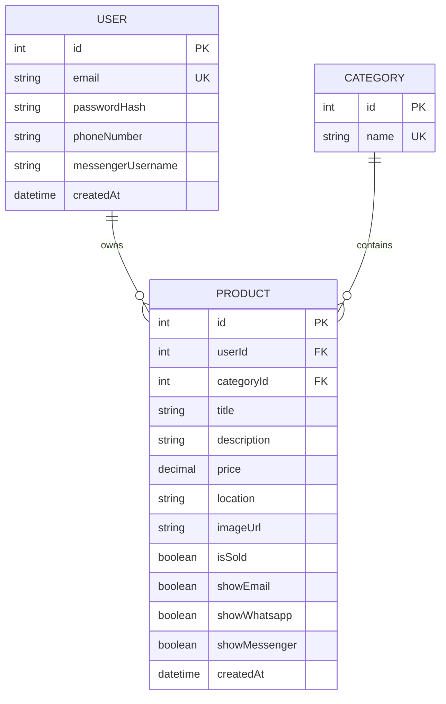

# UniBazaar Architecture

> **Purpose:** Document how the current UniBazaar application is structured and how its major parts communicate.
>
> This document describes the **current implementation**, not every future feature in the product vision.

---

# 1. Architecture Overview

UniBazaar currently uses a simple **client-server architecture**.

```text
┌──────────────────────────────┐
│          Browser             │
│                              │
│  Next.js + React + TypeScript│
└──────────────┬───────────────┘
               │
               │ HTTP / JSON
               ▼
┌──────────────────────────────┐
│       Express Backend        │
│       Node.js + TypeScript   │
│                              │
│  Auth • Products • Categories│
└──────────────┬───────────────┘
               │
               │ Prisma
               ▼
┌──────────────────────────────┐
│            MySQL             │
│                              │
│ Users • Categories • Products│
└──────────────────────────────┘

Frontend image uploads use:

Browser → Cloudinary → image URL → Backend → MySQL
```

The architecture is intentionally simple so it can be understood and evolved without introducing unnecessary infrastructure.

---

# 2. Main Components

UniBazaar currently has four important runtime areas:

```text
1. Frontend
2. Backend API
3. Database
4. Image Storage
```

---

# 3. Frontend Architecture

## 3.1 Technology

The frontend uses:

* Next.js
* React
* TypeScript
* Next.js App Router

The frontend application lives inside:

```text
frontend/
```

---

# 4. Frontend Responsibilities

The frontend is responsible for:

* rendering pages
* handling user interaction
* maintaining authentication state
* sending API requests
* displaying products
* collecting listing information
* initiating image uploads
* displaying seller contact options
* showing loading/error states

The frontend should **not** be trusted for security-sensitive authorization decisions.

The backend remains responsible for enforcing permissions.

---

# 5. Frontend Structure

The current frontend is organized approximately like this:

```text
frontend/
│
├── app/
│   ├── page.tsx
│   ├── layout.tsx
│   ├── globals.css
│   ├── login/
│   ├── signup/
│   └── products/
│
├── components/
│   ├── navbar.tsx
│   ├── product-card.tsx
│   ├── protected-route.tsx
│   └── image-upload.tsx
│
├── context/
│   └── auth-context.tsx
│
└── lib/
    └── api.ts
```

The exact structure may evolve as the application grows.

---

# 6. Root Layout

The root layout is defined in:

```text
frontend/app/layout.tsx
```

It currently provides:

```text
RootLayout
    │
    ├── AuthProvider
    │      │
    │      └── authentication state
    │
    ├── Navbar
    │
    └── Page content
```

This means authentication state is available to the application through the React context.

---

# 7. Authentication State

Authentication state is managed through:

```text
frontend/context/auth-context.tsx
```

The `AuthProvider` currently manages:

* authenticated user
* JWT token
* loading state
* signup
* login
* logout
* refresh current user

The token is stored in browser `localStorage`.

The application can then use:

```text
useAuth()
```

to access the authentication state from React components.

---

# 8. Frontend API Client

API communication is centralized in:

```text
frontend/lib/api.ts
```

The API client:

1. reads the backend base URL
2. retrieves the JWT from `localStorage`
3. adds the `Authorization: Bearer <token>` header when available
4. sends JSON requests
5. parses JSON responses
6. converts failed responses into `ApiClientError`

Conceptually:

```text
React Component
       ↓
apiRequest()
       ↓
HTTP request
       ↓
Express API
```

This separation prevents every component from having to manually implement authentication headers and error parsing.

---

# 9. Frontend Routes

The current application includes routes for:

```text
/
```

Marketplace/home page.

```text
/login
```

Login.

```text
/signup
```

Registration.

```text
/products/[id]
```

Product details.

```text
/products/new
```

Protected product creation.

The existing frontend documentation confirms these current user flows.

---

# 10. Product Components

Important reusable product-related components include:

```text
ProductCard
ImageUpload
ProtectedRoute
Navbar
```

The product card handles presentation of listing information.

The image upload component integrates with Cloudinary.

The protected route is used for frontend navigation/access control, but backend authorization remains mandatory.

---

# 11. Image Upload Architecture

Images are handled separately from the main database.

The current flow is:

```text
                Browser
                   │
                   │ upload
                   ▼
              Cloudinary
                   │
                   │ secure URL
                   ▼
                Browser
                   │
                   │ imageUrl
                   ▼
             Express API
                   │
                   ▼
                Prisma
                   │
                   ▼
                MySQL
```

The frontend uses `next-cloudinary` and receives a `secure_url`. The backend stores the resulting image URL with the product.

The database therefore stores the **URL**, not the image file itself.

---

# 12. Backend Architecture

## 12.1 Technology

The backend uses:

* Node.js
* Express
* TypeScript
* Prisma
* MySQL

The backend lives inside:

```text
backend/
```

---

# 13. Backend Responsibilities

The backend is responsible for:

* authentication
* authorization
* validation
* business logic
* product operations
* category retrieval
* database access
* security middleware
* rate limiting
* API error handling

The backend is the trusted layer.

---

# 14. Backend Structure

The current backend is organized roughly as:

```text
backend/
│
├── prisma/
│   ├── schema.prisma
│   ├── seed.ts
│   └── migrations/
│
└── src/
    ├── index.ts
    ├── errors.ts
    │
    ├── lib/
    │   └── prisma.ts
    │
    ├── middleware/
    │   ├── auth.ts
    │   └── errorHandler.ts
    │
    ├── routes/
    │   ├── auth.ts
    │   └── products.ts
    │
    └── utils/
        └── auth.ts
```

---

# 15. Backend Entry Point

The main server entry point is:

```text
backend/src/index.ts
```

It currently:

1. loads environment variables
2. creates the Express application
3. configures CORS
4. configures Helmet
5. configures rate limiting
6. configures JSON request limits
7. registers routes
8. connects Prisma to the database
9. starts the HTTP server

Important middleware includes:

```text
CORS
Helmet
express.json()
Global rate limiter
Authentication rate limiter
```

The application exposes a health endpoint:

```text
GET /health
```

and mounts the main API areas:

```text
/auth
/products
/categories
```

The current server implementation contains these responsibilities.

---

# 16. Authentication Flow

UniBazaar currently uses:

```text
Email + Password
       ↓
Express
       ↓
bcrypt password verification
       ↓
JWT issued
       ↓
Frontend stores token
       ↓
Future protected API requests
       ↓
Authorization: Bearer <token>
```

For signup:

```text
Frontend
   ↓
POST /auth/signup
   ↓
Validate university email
   ↓
Hash password
   ↓
Create User
   ↓
Generate JWT
   ↓
Return user + token
```

For login:

```text
Frontend
   ↓
POST /auth/login
   ↓
Find user
   ↓
Verify password
   ↓
Generate JWT
   ↓
Return user + token
```

---

# 17. Authentication Middleware

Protected backend routes use:

```text
backend/src/middleware/auth.ts
```

The middleware:

1. reads the `Authorization` header
2. expects a Bearer token
3. verifies the JWT
4. extracts user identity
5. places authenticated user information on the request
6. allows the request to continue

Conceptually:

```text
HTTP Request
     ↓
Authorization: Bearer TOKEN
     ↓
requireAuth()
     ↓
JWT verification
     ↓
Authenticated user
     ↓
Route handler
```

Invalid or missing tokens result in `401 Unauthorized`.

---

# 18. Authorization

Authentication answers:

> **Who are you?**

Authorization answers:

> **Are you allowed to do this?**

UniBazaar must enforce both.

For example:

```text
User A
  ↓
Attempts to delete
  ↓
User B's product
  ↓
403 Forbidden
```

Product ownership is checked in the backend product routes.

The frontend may hide buttons, but the backend must enforce ownership.

---

# 19. Product API

The main product routes live in:

```text
backend/src/routes/products.ts
```

The current implementation includes operations such as:

```text
GET    /products
GET    /products/me
GET    /products/:id
POST   /products
PUT    /products/:id
PATCH  /products/:id/sold
DELETE /products/:id
```

The API supports:

* listing products
* category filtering
* viewing a single product
* creating products
* updating products
* marking products as sold
* deleting products
* retrieving the authenticated user's products

The backend also validates seller ownership before modifying a listing.

---

# 20. Category API

Categories are currently exposed through:

```text
GET /categories
```

The backend retrieves categories from Prisma and sorts them by name.

---

# 21. Database Architecture

UniBazaar currently uses:

```text
MySQL
   ↑
Prisma
   ↑
Express
```

Prisma acts as the ORM and database access layer.

The current schema contains three main models:

```text
User
Category
Product
```

---

# 22. User Model

Conceptually:

```text
User
├── id
├── email
├── passwordHash
├── phoneNumber
├── messengerUsername
├── createdAt
└── products[]
```

A user can own multiple products.

The email is unique.

Passwords are not stored directly; a password hash is stored.

---

# 23. Category Model

Conceptually:

```text
Category
├── id
├── name
└── products[]
```

Category names are unique.

A category can contain many products.

---

# 24. Product Model

Conceptually:

```text
Product
├── id
├── userId
├── categoryId
├── title
├── description
├── price
├── location
├── imageUrl
├── isSold
├── showEmail
├── showWhatsapp
├── showMessenger
└── createdAt
```

Relationships:

```text
User 1 ─────────── * Product
Category 1 ─────── * Product
```

The current Prisma schema defines these relationships and uses foreign keys with user deletion cascading to owned products.

---

# 25. Database Relationship Diagram



---

# 26. End-to-End Request Flow

Consider a buyer opening a product.

```text
Browser
   │
   │ GET /products/123
   ▼
Express
   │
   ▼
Products Route
   │
   ▼
Prisma
   │
   ▼
MySQL
   │
   ▼
Product + seller/contact data
   │
   ▼
Express JSON response
   │
   ▼
Frontend
   │
   ▼
Product details UI
```

---

# 27. End-to-End Create Listing Flow

For a seller creating a product:

```text
Seller
  │
  │ fills form
  ▼
Next.js / React
  │
  │ optional image upload
  ▼
Cloudinary
  │
  │ image URL
  ▼
React form
  │
  │ POST /products
  ▼
Express
  │
  ├── requireAuth()
  │
  ├── validate input
  │
  ├── verify category
  │
  └── determine owner from JWT
  │
  ▼
Prisma
  │
  ▼
MySQL
  │
  ▼
Created Product
  │
  ▼
JSON response
  │
  ▼
Frontend
```

---

# 28. Security Architecture

The backend currently includes several basic security measures:

### JWT authentication

Protected resources require a valid JWT.

### Password hashing

Passwords are hashed using bcrypt.

### Ownership checks

Users can modify only their own products.

### Helmet

Security-related HTTP headers are configured through Helmet.

### CORS

Cross-origin requests are restricted according to environment configuration.

### Rate limiting

The application applies:

* global API rate limiting
* stricter authentication rate limiting

### JSON size limit

Incoming JSON payloads have a configurable size limit.

These controls are configured in the main Express entry point.

---

# 29. Environment Configuration

The backend expects environment configuration such as:

```text
DATABASE_URL
JWT_SECRET
PORT
NODE_ENV
CORS_ALLOWED_ORIGINS
TRUST_PROXY
```

Additional rate-limit and JSON-body settings are configurable.

The frontend uses:

```text
NEXT_PUBLIC_API_BASE_URL
NEXT_PUBLIC_CLOUDINARY_UPLOAD_PRESET
```

Sensitive credentials must not be committed to Git.

---

# 30. Local Development Architecture

During local development:

```text
Frontend
http://localhost:3000
        │
        │ HTTP
        ▼
Backend
http://localhost:4000
        │
        ▼
Aiven / MySQL
```

The frontend uses the backend base URL from:

```text
NEXT_PUBLIC_API_BASE_URL
```

The backend uses its database connection from:

```text
DATABASE_URL
```

---

# 31. Why This Architecture Is Appropriate for Now

This architecture is intentionally modest.

It gives the project:

* clear frontend/backend separation
* simple REST APIs
* relational data modeling
* centralized authentication
* straightforward local development
* room for future growth

It does not require:

* microservices
* message brokers
* distributed caching
* real-time infrastructure
* complex orchestration

For the current UniBazaar stage, those would add complexity without solving an immediate problem.

---

# 32. Future Evolution

The architecture may evolve as UniBazaar grows.

For example:

```text
Current:

Next.js
   ↓
Express
   ↓
Prisma
   ↓
MySQL
```

A future version could potentially introduce:

```text
Next.js
   ↓
API layer
   ↓
Business/domain layer
   ↓
Data access layer
   ↓
Database
```

Or technologies may change entirely.

The important principle is:

> **Keep boundaries clean enough that individual technologies can be replaced when necessary.**

The current architecture should therefore not be treated as permanent.

---

# 33. Future Campus Stores

Campus Stores will likely require additional concepts such as:

```text
Store
Store Owner
Store Product
Store Contact
```

A possible future relationship may become:

```text
User
 │
 ├── personal listings
 │
 └── Store
       │
       └── Products
```

Do not introduce these models into the current database until the product requirements are ready.

---

# 34. What Not to Assume

This document should not be used to assume that future features already exist.

For example:

* Campus Stores are not currently complete.
* Bundle listings are not currently complete.
* Listing expiration is not currently complete.
* Internal chat is intentionally not planned for MVP.
* Orders and payments are intentionally outside the MVP.

Architecture should follow the current product requirements.

---

# 35. Known Repository Hygiene Issue

During the architecture audit, unresolved Git merge-conflict markers were visible in the current GitHub versions of:

```text
backend/src/index.ts
frontend/context/auth-context.tsx
```

These files contained markers such as:

```text
<<<<<<< HEAD
=======
>>>>>>> ...
```

This should be treated as a repository hygiene issue and tracked separately.

Do **not** assume that the architecture is broken solely from this observation, because the local working copy may differ from the GitHub `main` branch.

Before future feature work depends on those sections, verify the working tree and repository state.

---

# 36. Recommended Development Boundary

Use this mental model while developing:

```text
┌──────────────────────────────────────┐
│              FRONTEND                │
│                                      │
│  UI • Forms • Navigation • State     │
└─────────────────┬────────────────────┘
                  │
                  │ HTTP / JSON
                  ▼
┌──────────────────────────────────────┐
│               BACKEND                │
│                                      │
│ Auth • Validation • Authorization    │
│ Business rules • API responses       │
└─────────────────┬────────────────────┘
                  │
                  │ Prisma
                  ▼
┌──────────────────────────────────────┐
│               DATABASE               │
│                                      │
│ Users • Categories • Products        │
└──────────────────────────────────────┘
```

And for images:

```text
Frontend
   ↓
Cloudinary
   ↓
Image URL
   ↓
Backend
   ↓
MySQL
```

---

# 37. Practical Rule for Future Changes

When adding a feature, identify which layers it touches.

For example:

### Product Search

```text
Frontend
   ↓
API
   ↓
Database query
```

### Seller Authentication

```text
Frontend
   ↓
Auth API
   ↓
JWT
   ↓
Auth middleware
```

### Bundle Listings

Likely:

```text
Frontend
   ↓
Product APIs
   ↓
Prisma schema
   ↓
MySQL
```

Thinking in layers helps prevent accidental coupling.

---

# 38. Architecture Principle

The most important architecture principle for UniBazaar is:

> **Keep the system simple enough to understand now, but structured enough to change later.**

The goal is not to predict the final architecture.

The goal is to build a clean enough foundation that the next architectural decision remains possible.
